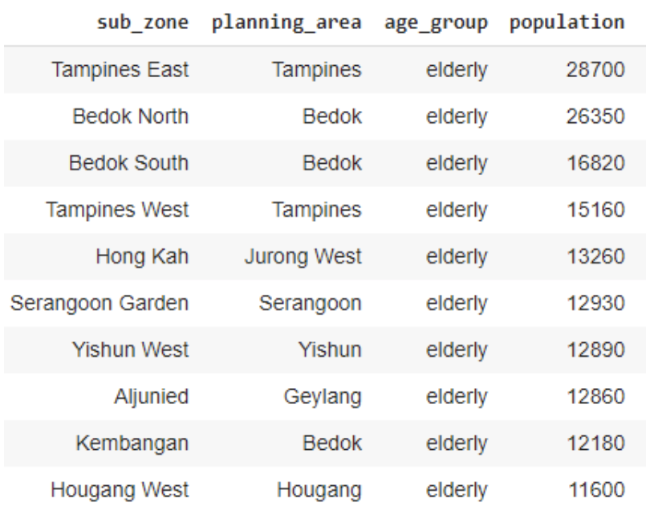

### Exploring population distribution by different age groups in Singapore

**Introduction**

Singapore is one of the well-known financial countries in Asia. Although the whole country is not large, a total of 5 regions, 55 planning areas and more than 300 subzones consist in the country.

By identifing the distributions of populations in different age groups, a more precise decision of facilities development can be made. Such as setting up more healthcare clinics in regions of higher popluation of elderly, or building more recreational factilites areas in the region with higher population of childrens.

Finding the popultation distribtuion of different age groups may have the factilites planning to the governement, or even setting up related bussiness to certain age groups.

**Methodology**

Population data of sinagpore in 2015 is selected from data.gov.sg. A total records of

For the age group mapping, in order to simplify the caterization, the related ranges of age are defined in the table below.

| **Age** | **Age group** |
| --- | --- |
| 0 - 10 | Children |
| 11 - 20 | Adolescent |
| 21 - 30 | Young adult |
| 31 - 65 | Adult |
| 65 + | Elderly |

**Discussion**

3 age groups are focused to be discussed in this study. The children group (with age ranged from 0 - 10), adolescent group (with age ranged from 11 - 20) and elderly (with age ranged 65 or above)

As the raw data table involves data with all gender (&quot;Total&quot;), male only and female only. The &quot;Total&quot; data is selected only for further analysis.

|  |
| --- |
| Raw data table of population by subzones in SG |

For the age data, since it is represented by range format, it is better to do some transformation in order to make the age data analysisable. Hence, mean age of the age range is taken for the referenced age.

Since the age data is in word description, it should be converted to number format in order to be able to do further analysis.

E.g. For the age range of 0 - 4, median of the range is calculated and age of 2 is retrieved.

|  |
| --- |
| Data with age range by subzones in SG |

After convertion, the age is processed and displayed as the following table below.

|  |
| --- |
| Data with processed age by subzones in SG |

Also, it is better to have some processing to the naming of the planning area. After processing, the result data is shown below.

|  |
| --- |
| Processed data table of population by subzones in SG |

Next is the differentation of different age groups. Age group is defined according to the age definition table mentioned above.

The data table below reflects the population of the children group.

By ranking the results in the top 10, Tampines East ranks 1st with population of 24080, Woodlands East ranks 2nd with population of 22280, while Jurong West Central ranks 3rd with population of 18120.

|  |
| --- |
| Data table of children population by subzones in SG |

By mapping the result into the bubbles, it is noticed that the regions of north sides and east sides have a larger popultation of children. After finding the location of the places, Tampine belongs to the east side of Singapore, while Woodlands belongs to the north side of Singapore. This supports the result of this mapping.

|  |
| --- |
| Children population distribtion by subzones in Singapore |

For the adolescent group, Tampines East ranks 1st with population of 33560, Woodlands East ranks 2nd with population of 29880, while Yunnan ranks 3rd with population of 20250.

|  |
| --- |
| Figure 3. Data table of adolescent population by subzones in SG |

The bubble map shows a larger poplutation of adolescants found in northern and eastern regions. As Tampine belongs to the east side of Singapore, and Woodlands belongs to the north side of Singapore. This supports the result of this mapping.

|  |
| --- |
| Adolescents population distribtion by subzones in Singapore |

|  |
| --- |
| Data table of elderly population by subzones in SG |

The bubble map shows a larger poplutation of adolescants found in east and middle regions. As Tampine belongs to the east side of Singapore, and Bedok belongs to the middle of Singapore. This supports the result of this mapping.

|  |
| --- |
| Elderly population distribution by subzones in Singapore |

**Conclusion**

In conclusion, simliarity is found in larger populations for the age group of children and adolescents. It is found that northern regions and eastern regions of Singapore have a larger population of children and adolescents, while the northern side and middle side have a larger population of elderly.

It is commonly found that the Tampine region has both a larger size of children, adolescents and elderly populations. As as result, governement or other parties may consider to develop more facilities or recreation complex to cater for the larger popultation or children, adolescents and elderly. Besides, some cross age group faclilties in this region can also be considered. While for the north region like Woodlands and east region like Tampines, facilities to children and adolescents can be enhanced.
